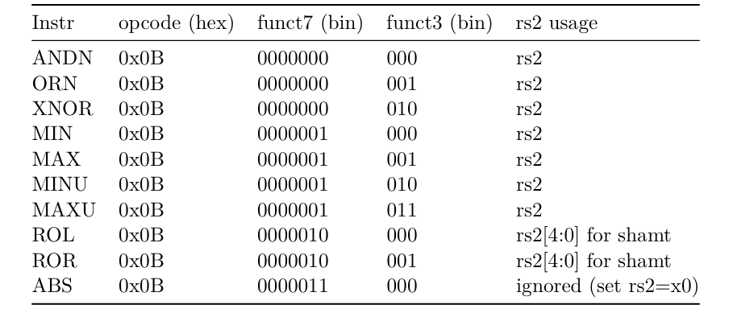
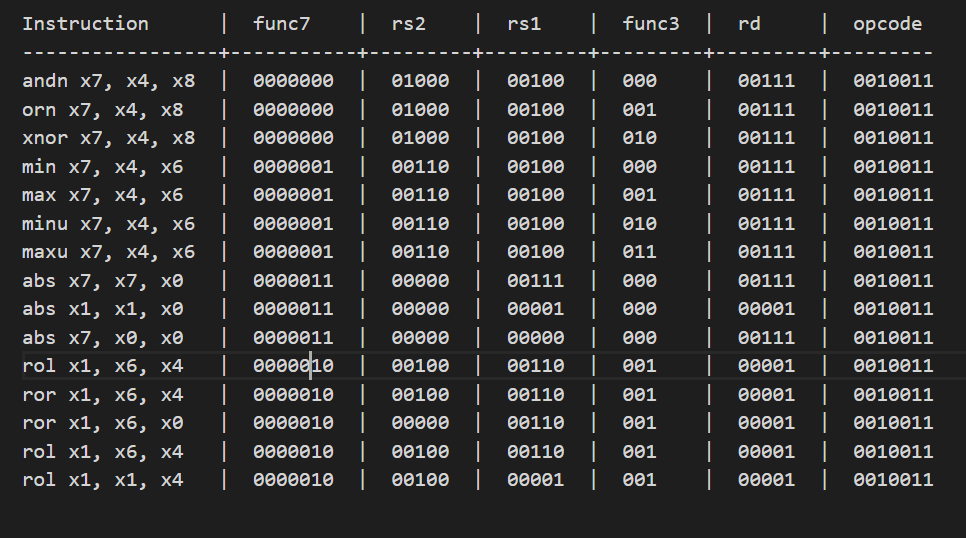

# RVX10 Instruction Encoding

This document shows the decoding of machine code for RVX10 instructions using the R-type instruction format:

# Instruction format (R-type style used by RVX10)

 
Machine code is interpreted as:

inst = (funct7 << 25) | (rs2 << 20) | (rs1 << 15) | (funct3 << 12) | (rd << 7) | opcode

All RVX10 instructions use `opcode = 0x0B`.

## Instruction Set

## Encoding Table

